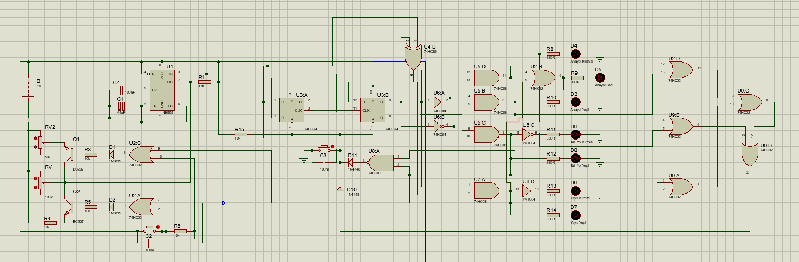
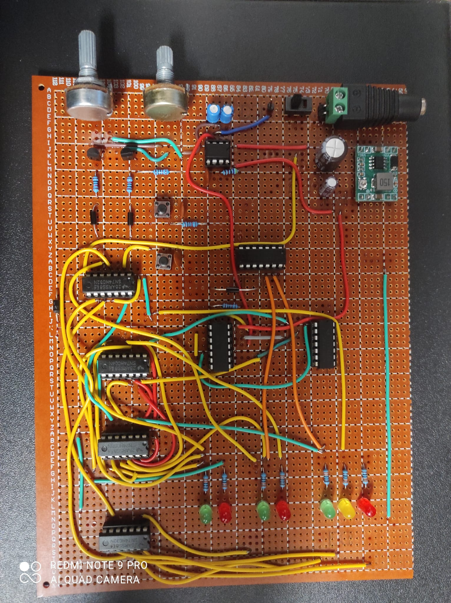

# Fault-Tolerant Digital Traffic Light Control System

[cite_start]A gate-level, hardware-controlled digital traffic light system designed without using any microcontrollers[cite: 10, 85]. [cite_start]This project features dynamic cycle acceleration via asynchronous pedestrian requests and hardware-enforced fail-safe mechanisms such as interlocking and conflict resolution[cite: 54, 61, 64].

## 📸 Project Visuals
| Proteus Schematic | Physical Implementation |
|---|---|
|  |  |

## 🚀 Key Features & Hardware Architecture
* [cite_start]**No Microcontrollers:** Fully implemented at the gate level using 74-series logic components and basic semiconductors[cite: 85].
* [cite_start]**Synchronous State Machine:** Built using an NE555 Timer in astable mode, dual 74HC74 D-Type Flip-Flops, and a 74HC86 XOR gate to generate a 2-bit synchronous counter[cite: 48, 51].
* [cite_start]**Dynamic Timing Control:** Integrated BC237 NPN transistors and potentiometers to dynamically scale the operating frequency ($0.133\text{ Hz} - 0.699\text{ Hz}$) by altering the RC time constant[cite: 28, 50, 79].
* [cite_start]**Asynchronous Pedestrian Intervention:** A debounced hardware switch prompts an accelerated cycle towards the pedestrian phase safely through combinational state progression without compromising cross-traffic safety[cite: 64, 65, 67, 86].

## 🛡️ Hardware-Enforced Fail-Safe Mechanisms
[cite_start]Unlike software-defined solutions, safety metrics in this system are **hardware-impossible** to bypass[cite: 87]:
1. [cite_start]**Dual Green Protection (Conflict Resolution):** A 74HC00 NAND gate instantly detects if both main and side roads are assigned a GREEN status simultaneously[cite: 25, 69, 70]. [cite_start]It immediately triggers an asynchronous reset to a safe initial state (State 0: Main Green, Side Red)[cite: 71].
2. [cite_start]**Dead State Protection (Dark Intersection):** A supervisory network utilizing 74HC32 OR gates continuously monitors all lighting channels[cite: 74]. [cite_start]If an illegal state occurs where all lights are turned OFF (all outputs LOW) during power-up or operation, the system automatically auto-resets back into the safe initial cycle[cite: 73, 75].

## 📋 System State Sequence
| State (Phase) | Main Road Lights | Side Road Lights | Pedestrian Lights | Description |
|---|---|---|---|---|
| **State 0** | GREEN | RED | RED | [cite_start]Traffic flows on the main road[cite: 59]. |
| **State 1** | YELLOW | RED | RED | [cite_start]Main road prepares to stop[cite: 59]. |
| **State 2** | RED | GREEN | RED | [cite_start]Right of way is given to the side road[cite: 60]. |
| **State 3** | RED + YELLOW | RED | GREEN | [cite_start]Safe crossing duration for pedestrians[cite: 60]. |

## 📦 Bill of Materials (BOM)
* [cite_start]**ICs (Logic & Timing):** NE555, 74HC74, 74HC86, 2x 74HC32, 2x 74HC08, 74HC00, 74HC04 [cite: 20, 21, 22, 23, 24, 25, 26]
* [cite_start]**Semiconductors:** 2x BC237 NPN Transistors, 4x 1N4148 Fast Switching Diodes [cite: 28, 29]
* [cite_start]**Display Elements:** 3x Green LEDs, 3x Red LEDs, 1x Yellow LED [cite: 31, 32, 33]
* [cite_start]**Passives:** 100kΩ / 50kΩ Potentiometers, 47kΩ, 6x 10kΩ, 7x 330Ω Resistors, 44µF Electrolytic & 3x 100nF Ceramic Capacitors [cite: 35, 36, 37, 38, 39, 40, 41]

## 📂 Repository Contents
* [cite_start]`/Simulation`: Contains the Proteus Design Suite schematic file[cite: 18].
* [cite_start]`/Documents`: Contains the comprehensive academic project report[cite: 3].
